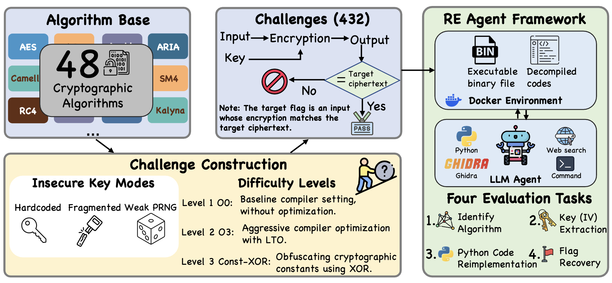

# CREBench: Evaluating Large Language Models in Cryptographic Binary Reverse Engineering

[](https://arxiv.org/abs/2604.03750)

Official code repository for the paper "CREBench: Evaluating Large Language Models in Cryptographic Binary Reverse Engineering".

## Introduction



CREBench evaluates reverse-engineering performance on cryptographic binaries over four levels:

1. `L1`: algorithm identification
2. `L2`: key (IV) extraction
3. `L3`: wrapper-level code reimplementation
4. `L4`: flag recovery

Current main benchmark corpus is `CREBench` with:

- `48` algorithms
- `3` key modes: `hardcode_plain`, `fragmented_build`, `weak_prng_seeded`
- `3` active difficulties: `O0`, `O3`, `constxor`

Supported models include:

- `gpt-5.4`
- `gpt-5.4-mini`
- `gpt-5.2`
- `o4-mini`
- `gemini-2.5-pro`
- `claude-sonnet-4-6`
- `doubao-seed-1-8-251228`
- `mimo-v2-pro`

## Installation

### Requirements

- Python `3.10+`
- Docker
- A working Python environment for this repo
- For `codex`: local Codex CLI installed on host

Install dependencies:

```bash
pip install -r requirements.txt
```

If you want Codex token accounting through LiteLLM, install the proxy extras:

```bash
pip install 'litellm[proxy]'
```

Warning: do not use LiteLLM `1.82.7` or `1.82.8` because of the backdoor vulnerability.

### Docker Setup

The runtime image expects Ghidra archive in `docker/` before build.

1. Open Ghidra 11.0.1 release page: <https://github.com/NationalSecurityAgency/ghidra/releases/tag/Ghidra_11.0.1_build>
2. Download `ghidra_11.0.1_PUBLIC_20240130.zip`
3. Place it at `docker/ghidra_11.0.1_PUBLIC_20240130.zip`

Example:

```bash
wget https://github.com/NationalSecurityAgency/ghidra/releases/download/Ghidra_11.0.1_build/ghidra_11.0.1_PUBLIC_20240130.zip \
  -O docker/ghidra_11.0.1_PUBLIC_20240130.zip
```

Build image:

```bash
sudo docker build -t rev-sandbox:latest -f docker/Dockerfile docker
```

## Configuration

Use a repo-root `.env` file for API credentials. Runtime scripts load `.env` automatically.

Example `.env`:

```dotenv
# OpenAI
OPENAI_API_KEY=""
OPENAI_API_BASE_URL=https://api.openai.com/v1

# Azure OpenAI
AZURE_OPENAI_API_KEY=""
AZURE_OPENAI_ENDPOINT=""
AZURE_OPENAI_API_VERSION=""

# Claude
CLAUDE_API_KEY=""

# Gemini
GOOGLE_APPLICATION_CREDENTIALS=/path/to/service-account.json
GEMINI_PROJECT=""
GEMINI_LOCATION=global

# Doubao
DOUBAO_API_KEY=""
DOUBAO_BASE_URL=""

# MiMo
MIMO_API_KEY=""
MIMO_BASE_URL=""

# Tavily web tools (optional)
TVLY_API_KEY=""

# Codex
CODEX_MODEL=""
```

## Evaluation Workflow

### Pass@k Evaluation

`scripts/run_passk_eval.py` is the recommended runner for official evaluation and benchmarking.

It handles:

- pass@k repeats
- full `CREBench` corpus sweeps
- parallel execution (`--jobs`)
- resumable suites (`--resume-dir`)
- suite-level summaries and CSV reports

Run one challenge:

```bash
python3 scripts/run_passk_eval.py \
  --model gpt-5.4 \
  --challenge AES-128-CBC \
  --difficulty O0 \
  --key-mode weak_prng_seeded \
  --pass-k 3
```

Run full matrix (`48 * 3 * 3`):

```bash
python3 scripts/run_passk_eval.py \
  --model gpt-5.4 \
  --all-c-all \
  --all-key-modes \
  --difficulty ALL \
  --pass-k 3 \
  --eval-mode full \
  --jobs 4 \
  --max-rounds 30 \
  --max-tokens 600000
```

Resume an interrupted suite:

```bash
python3 scripts/run_passk_eval.py \
  --model gpt-5.4 \
  --all-c-all \
  --all-key-modes \
  --difficulty ALL \
  --pass-k 3 \
  --jobs 4 \
  --resume-dir outputs/passk/<your-suite-dir>
```

### Single-run Runner

`run_reverse.py` remains useful for single-run debugging / development.

```bash
python3 run_reverse.py \
  --model gpt-5.4 \
  --challenge-path CREBench/AES-128-CBC \
  --key-mode weak_prng_seeded \
  --difficulty O0 \
  --eval-mode full
```

Provider selection for OpenAI-family models (`gpt-*`, `o4-*`) and `codex`:

- You can force provider with `--provider openai` or `--provider azure`.
- If omitted, runner selects `openai` when `OPENAI_API_KEY` is set.
- Otherwise it selects `azure` when Azure credentials are set.
- If neither is available, run fails with provider resolution error.

### Codex-specific Run Notes

Codex local runner:

```bash
python run_reverse.py \
  --model codex \
  --provider openai \
  --challenge-path CREBench/AES-128-CBC \
  --key-mode weak_prng_seeded \
  --difficulty O0
```

Codex local runner with Azure backend:

```bash
python run_reverse.py \
  --model codex \
  --provider azure \
  --challenge-path CREBench/AES-128-CBC \
  --key-mode weak_prng_seeded \
  --difficulty O0
```

Codex local runner with explicit backend model override:

```bash
python run_reverse.py \
  --model codex-gpt-5.4 \
  --provider openai \
  --challenge-path CREBench/AES-128-CBC \
  --key-mode weak_prng_seeded \
  --difficulty O0
```

Codex + LiteLLM proxy path for request-level token accounting:

```bash
export REV_CODEX_USE_LITELLM=1

python run_reverse.py \
  --model codex \
  --provider azure \
  --challenge-path CREBench/AES-128-CBC \
  --key-mode weak_prng_seeded \
  --difficulty constxor \
  --max-tokens 500000 \
  --output-dir outputs/codex-litellm-aes
```

Notes for Codex + LiteLLM:

- `--provider openai` and `--provider azure` are both supported for Codex.
- When `--provider` is omitted for Codex, the local Codex config is used if present; otherwise the runner auto-configures from available credentials.
- Token cutoff is enforced at the request level, not token-by-token.
- A single in-flight backend request can overshoot the remaining budget.
- LiteLLM artifacts are written to the run output directory:
- `litellm_proxy_config.yaml`
- `litellm_proxy_stdout.log`
- `litellm_proxy_stderr.log`
- `litellm_usage.jsonl`
- `litellm_trace.jsonl`

### Output Layout

Single run (`run_reverse.py`) output:

```text
outputs/<challenge>/<key_mode>/<difficulty>/<provider>/<model>/<eval_mode>/<timestamp>/
```

Suite run (`run_passk_eval.py`) output:

```text
outputs/passk/<suite-name>-<timestamp>/
  suite_manifest.json
  summary.json
  report.md
  case_results.csv
  attempt_results.csv
  runs/
    <challenge>/<key_mode>/<difficulty>/attempt-<n>/
```

Per-run artifacts include:

- `record.txt`
- `score.json`
- `run_metrics.json`
- `run_metadata.json`
- `conversation.json`

## Project Structure

```text
CREBench/                     # Our repo
  CREBench/                   # Main benchmark corpus (432 challenges with 48 algorithms)
    AES-128-CBC/
    DES/
    RC4/
    SM4-CBC-Official/
    ...
  src/reverse_agent/          # Agent runtime, tools, sandbox, evaluator
  scripts/
    run_passk_eval.py         # Primary pass@k runner
  run_reverse.py              # Single-run entry
```

## Citation

If you find this project useful, please cite:

```bibtex
@article{chen2026crebench,
  title={CREBench: Evaluating Large Language Models in Cryptographic Binary Reverse Engineering},
  author={Chen, Baicheng and Wang, Yu and Zhou, Ziheng and Liu, Xiangru and Li, Juanru and Chen, Yilei and He, Tianxing},
  journal={arXiv preprint arXiv:2604.03750},
  year={2026}
}
```
